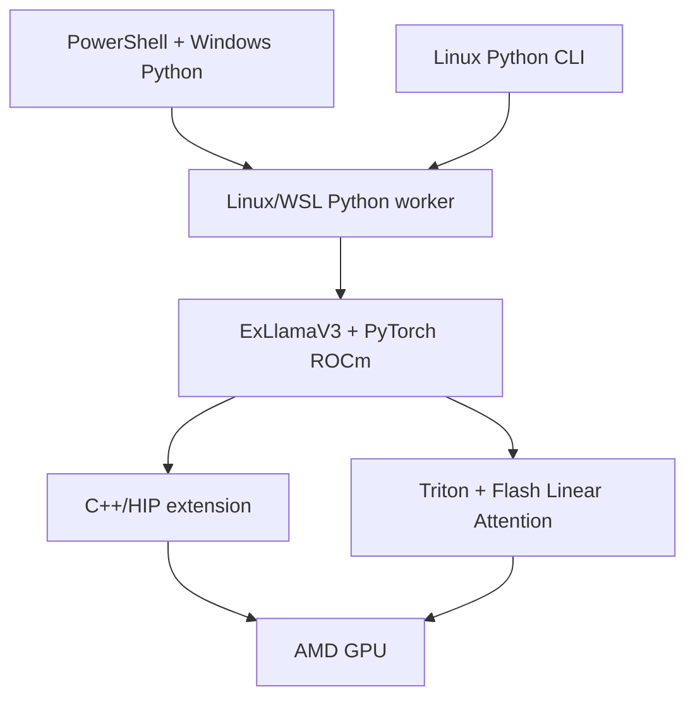

# EXL3 and AMD execution

EXL3 is Turboderp/ExLlamaV3's low-bit weight representation. It builds on [QTIP](https://github.com/Cornell-RelaxML/qtip), representing weight groups with compact trellis codes and procedural codebooks. Its packing and regularization differ from QTIP. See [upstream format notes](https://github.com/turboderp-org/exllamav3/blob/ca13bdd83a1f4a74fd817b88f49509e0f22a9b07/doc/exl3.md).

Models are directories containing config, tokenizer assets and Safetensors shards. Safetensors is the container: packed EXL3 tensors are not dense BF16 tensors, and no file needs an `.exl3` suffix. Quantization can reduce memory traffic, but disk bytes, GPU residency and host memory are different measurements.

## Why a separate runtime?

A GGUF loader and ordinary GGML kernels do not supply this project's EXL3 decoding path. Native execution needs matching metadata parsing, packed tensor decoding and model support. Renaming a shard cannot provide those operations; reconstructing and re-quantizing into GGUF would be a separate lossy conversion.

ExLlamaV3 supplies the base loader, model, converter, cache and generator. CarouselAether supplies the ROCm port. This project extends it with AMD compatibility repairs, small-row projection kernels, cache/attention integration and CLI/HTTP interfaces. Familiar flags do not imply binary compatibility with llama.cpp.

The installation record identifies the environment and hashed extension, independently of the selected model. PyTorch ROCm retains `torch.cuda` API names; these do not imply NVIDIA execution.

MTP proposes tokens with an integrated draft component and verifies them with the target. It helps only when acceptance offsets its extra costs. Eligible shared packed projection kernels reuse decoded fragments across up to nine token rows; unsupported layouts fall back. Neither EXL3 nor MTP guarantees a token rate.

Serving keeps weights loaded but uses independent state for each serialized request. [Tools](TOOL-CALLING.md) are returned to the harness for execution. See [upstreams](UPSTREAMS.md), [dependencies](DEPENDENCIES.md) and [cache options](KV-CACHE.md).
