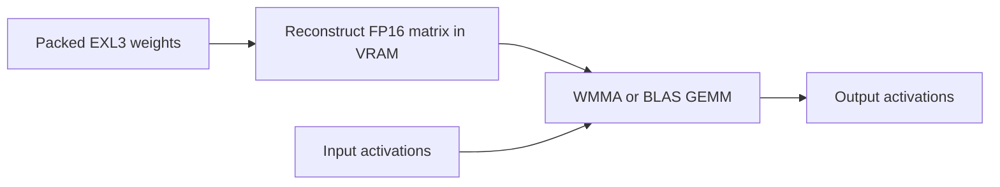

# Prefill, decode, and megakernel investigation

Investigated September 26, 2026. The objective is lower model prefill and
decode latency on RX 7800 XT / gfx1101. This is an evidence-backed development
plan, not a claim that a new kernel or throughput improvement has shipped.
Existing uncommitted KV-cache work was inspected and preserved.

Follow-up status: items 1–2 are covered by the [packed MLP report](PACKED-MLP-PERFORMANCE.md);
items 3–4 are covered by the [prefill and paired MLP report](PREFILL-MLP-FUSION.md).
Measured winners are primary automatically. The paired kernel is retained;
additional graph caching was not promoted. Items 5–6 are now covered by the
[vocabulary-head and attention report](HEAD-ATTENTION-PERFORMANCE.md), with
automatic selection for validated shapes. Persistent scheduling remains
outside this follow-up.

## Recommendation

Build a set of EXL3- and gfx1101-specific projection/fusion kernels, with
separate strategies for prefill and decode. Start with the large MLP shapes
and small-row dispatch gap. Use graph replay across larger validated regions
when it reduces measured wall time. Consider a persistent whole-model
scheduler only after measuring the overhead left by those changes.

A megakernel is a legitimate optimization technique. It keeps work on the GPU
across multiple operations, reducing launches, synchronization, and some
intermediate memory traffic. It does not remove the need to read model weights,
decode EXL3's trellis representation, or respect dependencies between layers.
Larger fusion can also increase register/LDS use and reduce occupancy.

The [MPK paper](https://arxiv.org/html/2512.22219v1) demonstrates this approach
on NVIDIA A100/H100/B200, using BF16 models. Its evaluated single-batch gains
over optimized serving baselines are 1.0–1.7x; those results do not predict
gains for this quantized AMD runtime. The
[implementation](https://github.com/mirage-project/mirage) generates CUDA and
uses a device scheduler. Adapting its ideas here requires AMD kernels,
EXL3 decoding, hybrid recurrent state, and MTP integration.

## What the repository and local model actually contain

The available local 27B models share this architecture:

| Property | Observed value |
| --- | --- |
| Text architecture | `qwen3_5_text` |
| Blocks | 64: 48 Gated DeltaNet, 16 full attention |
| Hidden / MLP intermediate width | 5120 / 17408 |
| Full-attention query / KV heads | 24 / 4, head dimension 256 |
| Vocabulary | 248320 |
| Main MLP projection geometry | 5120→17408, 17408→5120 |
| Target MLP tensor storage | Approximately 4.287 decimal GB |
| Target block and final-norm tensor storage | Approximately 6.148 decimal GB |
| Output-head tensor storage | 0.636 GB default-codebook model; 0.477 GB mul1 candidate |
| Embedding tensor storage | 2.543 GB, normally on CPU in this runtime |
| Separate MTP tensor storage | Approximately 0.213 GB, excluding the shared head/embedding |

These byte counts came from local Safetensors headers; they are stored tensor
sizes, not measured GPU memory transactions. MLPs account for roughly 70% of
the target block tensor bytes. Attention-only work therefore misses much of
the short-context weight-streaming cost. This does not prove the same
percentage of runtime is spent in MLPs.

The subsequent [MiMo 9B baseline and packed-kernel work](PACKED-MLP-PERFORMANCE.md)
identified the local K5/H6 mul1 model with BF16 MTP donor: 32 blocks, hidden
width 4096 and intermediate width 12288. The [prefill and paired MLP follow-up](PREFILL-MLP-FUSION.md)
records the next two implementation items and their validation.

Existing optimizations already cover substantial work:

- Packed GEMV for one row, and packed small-M for eligible 2–9 rows, including
  reuse of decoded fragments across MTP verification rows.
- Native GDN and optional MLP graphs. A graph groups dispatches; it does not
  turn all enclosed operations into one GPU kernel.
- FP32-output WMMA prefill, reconstruction with folded Hadamard transforms,
  and a different prefetch tile for at least 512 rows.
- Quantized paged attention, guarded long-context schedules, MTP, optional
  draft graphs/GPU bookkeeping, and prefix reuse.

Primary implementation references:
[compatibility dispatch](../src/quantlab/methods/exl3/compat.py),
[packed/reconstructed projections](../vendor/rocm-exl3/exllamav3/modules/quant/exl3.py),
[small-M kernels](../vendor/rocm-exl3/exllamav3/exllamav3_ext/rocm/quant/rdna-smallm.hip.h),
[WMMA prefill](../vendor/rocm-exl3/exllamav3/exllamav3_ext/rocm/hgemm_wmma.hip),
[GDN](../vendor/rocm-exl3/exllamav3/modules/gated_delta_net.py), and
[MLP](../vendor/rocm-exl3/exllamav3/modules/mlp.py).

## Bandwidth is a diagnostic, not the acceptance metric

AMD specifies [624 GB/s physical memory bandwidth and 64 MB Infinity Cache](https://www.amd.com/en/products/graphics/desktops/radeon/7000-series/amd-radeon-rx-7800-xt.html).
Its separate cache-assisted “effective bandwidth” number is not the streaming
bandwidth available to multi-gigabyte model weights.

90–95% of 624 GB/s is 562–593 GB/s. That can be a stretch target for a suitably
large streaming kernel; it is not a sensible blanket requirement for full
inference. Prefill reuses weights across many tokens and needs matrix compute
efficiency. Decode mixes weight decoding, matrix/vector work, recurrent state,
KV reads, reductions, and synchronization. Removing memory traffic can improve
token latency even while reported bandwidth decreases.

For dense target-only decode, an intentionally optimistic weight-only bound is:

```text
target forwards/s <= sustained bandwidth / bytes streamed per target forward
```

Using target tensors plus head as a rough traffic proxy gives 6.625–6.784 GB,
not the entire 9.4–9.6 GB directory. At the advertised 624 GB/s that is roughly
92–94 forwards/s, before KV, recurrent work, decoding instructions, or any
overhead. This is not a predicted attainable token rate. A lookup does not
read the complete embedding table, and MTP weights are not part of a
target-only pass.

For MTP, measure the complete round instead:

```text
emitted tokens/s = emitted tokens per round /
                  (draft time + verification time + sampling/bookkeeping time)
```

Several accepted tokens can share one target-weight pass. Conversely, each
draft step can read the shared vocabulary head again. Multiplying an MTP
tokens/s figure by the whole model-directory size does not measure bandwidth.

## Fresh hardware diagnostics

Bounded synthetic operator probes used the registered extension (SHA-256
prefix `df35ba80b0f6`), Torch 2.13.0+rocm7.2, HIP 7.2.53211, and the existing
GPU lease/WSL monitor. Torch allocation was capped at 25% of device capacity.
No inference extension was rebuilt or replaced. A tiny host-only helper read
HIP attribute enum values from the installed headers.

The device identified itself as RX 7800 XT / gfx1101 and returned
`hipDeviceAttributeCooperativeLaunch = 0` with a successful API status.
No cooperative kernel launch was attempted.

Two corrected probe processes measured approximately **495.1–495.2 GB/s** for
512 MiB device-to-device copies, counting both reads and writes. The 128 MiB
case measured approximately 524 GB/s. These are achievable copy-kernel
measurements under the current conditions, not a universal read-only bandwidth
ceiling. They do not establish 90–95% memory utilization during inference.

Representative default-codebook packed projection medians from the corrected
WMMA-prefill process are below. Each projection includes input/output
Hadamards and FP32 output. An “evicted” sample follows a 256 MiB read/write
pass intended to put pressure on Infinity Cache; no hardware counter proves
complete eviction. Values are microseconds.

| Projection | Rows | Hot eager | Evicted eager | Evicted graph replay |
| --- | ---: | ---: | ---: | ---: |
| 5120→17408, 2 bits | 1 | 142.1 | 195.3 | 232.8 |
| 5120→17408, 2 bits | 7 | 195.9 | 226.7 | 262.3 |
| 17408→5120, 2 bits | 1 | 139.5 | 213.7 | 258.0 |
| 17408→5120, 2 bits | 7 | 190.7 | 228.9 | 254.0 |
| 5120→1024, 2 bits | 1 | 24.2 | 50.8 | 87.5 |
| 5120→248320 head, 4 bits | 1 | 1907.5 | 2070.6 | 2096.5 |

For the two large MLP shapes, counting one packed-weight read per invocation
gives about 98–114 GB/s with evicted eager dispatch, and 85–98 GB/s with
evicted graph replay across the displayed row counts. The head gives about
307 / 303 GB/s respectively. These are **logical packed-byte/time ratios**:
they omit transforms, repeated memory transactions, instruction throughput,
and other traffic. They must not be labeled percentages of DRAM utilization.
M=7 does not multiply the weight byte count by seven.

The measured graph replay for one projection was slower than eager dispatch
in this harness. That does not predict the result of a graph spanning dozens
of operations; it does prevent assuming that adding a graph always improves
latency. Events include dispatch/scheduling gaps. Use whole-region wall timing
to decide whether larger capture regions help.

The register-WMMA small-M variant took approximately 10–41% longer than dot
under evicted eager dispatch in the large tested M=3/7 projection cases across
the two processes. Changing the prefill GEMM implementation does not make that
variant a better decode default. Full-model choices still require the
same-weight acceptance checks below.

Fresh-process prefill controls used the same seeded synthetic tensors and
one backend setting per process. These are FP16-input, FP32-output GEMM
medians, excluding reconstruction and Hadamards:

| K→N | Input rows | BLAS, ms | WMMA selection, ms |
| --- | ---: | ---: | ---: |
| 5120→17408 | 32 | 0.872 | 0.870 (BLAS fallback) |
| 5120→17408 | 64 | 1.759 | 0.854 |
| 5120→17408 | 256 | 4.422 | 1.805 |
| 5120→17408 | 1024 | 16.571 | 5.955 |
| 17408→5120 | 32 | 0.952 | 0.941 (BLAS fallback) |
| 17408→5120 | 64 | 1.735 | 1.218 |
| 17408→5120 | 256 | 4.602 | 1.744 |
| 17408→5120 | 1024 | 17.614 | 5.887 |

This confirms the value of the **existing** WMMA path on these shapes, not
a newly implemented speedup. The synthetic M=1024 WMMA cases achieve about
31 TFLOP/s using the conventional `2*M*K*N / time` count. Neither that number
nor the operator speed ratio predicts whole-model prefill. The M=32 fallback
also confirms that the short-row region deserves its own implementation.

Probe details: three warmup calls, seven timed samples per operator, and ten
copies per timed copy group. All samples were retained, including a first-group
outlier in the 128 MiB copy case. There were 32 packed projection cases per
process, each checking finite output and exact same-input graph/eager replay.
These checks are not an independent numerical oracle or model-quality test.
Raw requests, source, samples, and monitor results remain in the ignored
`artifacts/optimization-audit-20260926/` directory.

Both corrected runs completed with monitor/worker exit zero and no resource
stop. Peak Torch allocated/reserved memory was 1.00/1.25 GiB. The already
documented `SharedSignalPool` teardown warning also appeared. No new full-model
generation, quality comparison, 9B run, or hardware-counter collection was
performed, and no inference default was changed. Documentation links and
diff whitespace were checked; these documentation changes need no unit-suite
rerun.

The first exploratory prefill comparison was invalid: it changed
`EXL3_HGEMM_IMPL` within one process, but
[`hgemm_use_wmma()`](../vendor/rocm-exl3/exllamav3/exllamav3_ext/hgemm.cu)
samples that variable once. Both labels ran BLAS. The failed comparison was
retained and explicitly marked invalid; subsequent runs select one backend
per process. It does not affect the copy or packed-projection measurements.

## Ranked implementation work

| Priority | Work | Main benefit | Evidence / limitation |
| --- | --- | --- | --- |
| 1 | Tune packed MLP kernels for actual gfx1101 shapes, row counts, and codebooks | Decode and MTP verification | MLP weights dominate target storage; current scheduling partly derives from a gfx1151 sweep |
| 2 | Add a noncooperative packed path for roughly 10–64 rows; measure the crossover | Short prefill and chunk tails | Wrapper currently reconstructs for every row count above the verified small-M limit |
| 3 | Prototype tiled EXL3 decode directly into a WMMA GEMM; retain a tuned dense alternative | Large fresh prefill | Current path materializes full FP16 weight matrices; GEMM remains the larger measured cost |
| 4 | Fuse projection epilogues / paired MLP work, then capture larger decode regions | Decode, particularly smaller models | Three launches remain around individual packed projections; existing block graphs already remove some host work |
| 5 | Tune attention schedules for the precise cache formats and occupied lengths | Long-context prefill/decode | Low-bit formats change decode cost and can miss the Q8 long-profile dispatch |
| 6 | Optimize the full-vocabulary draft/head path and device bookkeeping | MTP latency | Shared large head runs repeatedly; previous shortlists, cached draft projections, and depth controller did not supply general gains |
| Later | Persistent scheduler across one block, then bounded target/draft steps | Remaining launch/synchronization overhead | Requires a measured advantage over the graph baseline and a validated progress/synchronization design |

### Packed decode: specialize before adding a scheduler

The split-K choice in
[`exl3_gemv_rdna.hip`](../vendor/rocm-exl3/exllamav3/exllamav3_ext/rocm/quant/exl3_gemv_rdna.hip)
explicitly cites upstream gfx1151 measurements. Small-M reuses this heuristic
without a row-count-specific schedule, although register and arithmetic costs
change with M. Benchmark dot and WMMA variants per `(GPU, K, N, rows, bits,
codebook, output dtype)`, including the large output head. Measure with cache
pressure as well as hot repeated weights; a 22 MB packed MLP projection can
benefit from the 64 MB Infinity Cache in isolation.

Investigate coalesced packed loads, decode/load pipelining, blocks per output
tile, and register use. Retain a small offline-selected dispatch table if
there are stable wins; avoid online autotuning in the token loop. Do not make
`wmma-register` a universal default: the existing full-model sweep already
contains a regression for it.

### Short prefill has a real dispatch gap

`compat.install()` forces reconstruction above `native_smallm_max_rows`
(currently 9), even though the inherited threshold is 144. This is an explicit
workaround for the upstream cooperative path. The WMMA prefill path starts
at 64 rows; short tails can therefore reconstruct a large matrix and use BLAS
for little token reuse.

Implement actual noncooperative 16/32/64-row kernels and benchmark crossover
points against reconstruction. Raising the declared native row limit does
not implement those kernels. Preserve tail masks and packed codebook guards.

### Prefill needs matrix throughput as well as fewer bytes

The current large-row path is approximately:



A candidate would decode weight tiles into LDS/registers as GEMM consumes
them, avoiding the complete FP16 matrix write and subsequent read. Start with
the 5120↔17408 MLP shapes, cb0/cb2, and the existing numerical contract.
Reusing a decoded tile across many M rows is essential: separately decoding it
for every output tile can erase the bandwidth saving.

The existing instrumented 27B request recorded approximately 5.53 s in GEMM
entry intervals and 0.78 s in reconstruction. These are inclusive GPU-event
intervals, not exclusive kernel self-times. Removing reconstruction alone
cannot plausibly explain a several-fold full-request improvement. A fused
implementation must retain or improve GEMM efficiency too. Compare against
further dense-WMMA tiling/prefetch work as a simpler competing implementation.
Keep FP32 output/accumulation and the validated reduction behavior; FP16
output is not an equivalent substitute.

### A practical first fusion kernel

Start with paired gate/up projection epilogues at M=1, then extend only where
M=2–9 measurements support it. Producing complete 128-output groups in a
workgroup could fold each output Hadamard, scaling, and SwiGLU into the paired
projection. Keep the down projection as a separate launch initially because
it depends on contributions spanning the intermediate dimension. Embed the
result in the existing graph infrastructure.

Two constraints prevent a naive fusion:

- Current packed output tiles are 16 wide, but the output Hadamard spans 128
  values. A block must own all dependencies or use a separate synchronization
  boundary. Grouping eight tiles can reduce available parallelism or increase
  register pressure.
- Gate and up have their own input sign/scale vectors. The local layer-0
  tensors differ. Sharing their input Hadamard without checking those vectors
  changes the operator. A joint kernel must apply each projection's transform.

Residual/RMSNorm and QKV/cache-write fusions are subsequent candidates where
dependency and reduction boundaries permit them. GDN convolution, recurrent
updates, and gates already have native paths; profile what remains before
duplicating that work.

### Whole-model persistence is a separate engineering step

The compatibility wrapper deliberately avoids cooperative dispatch on the
configured WSL path, and the fresh device query reports that capability as
unsupported. HIP requires a suitable cooperative launch for
[`this_grid().sync()`](https://rocm.docs.amd.com/projects/HIP/en/latest/how-to/hip_runtime_api/cooperative_groups.html).
The existing one-block cooperative probe cannot validate multi-block progress.

Persistent kernels need not use that API: a bounded device queue with explicit
dependency signaling is another design. It still needs demonstrated forward
progress, correct memory ordering, and resource residency. An oversubscribed
grid with software barriers can deadlock. Support for HIP graphs does not
establish those properties.

If later measurements justify persistence, begin with one bounded target
verification step or block. Preserve host-visible cancellation/shutdown and
request limits, and preserve GDN history/rollback and MTP checkpoint semantics.
Avoid an unbounded generation loop inside a display-GPU kernel.

## Existing experiments constrain the plan

- [WMMA prefill](GPU-PERFORMANCE.md) improved the recorded 27B 4K case from
  290 to 540 tok/s; the later tile revision produced a smaller further gain.
  The initial investigation used a BLAS default; the subsequent prefill/MLP
  follow-up changed it to verified automatic selection. Record the actual
  prefill implementation in every baseline and keep chunk sizes identical.
- [The full CLI sweep](RUNTIME-PERFORMANCE.md) found only small aggregate
  decode differences from global warp counts, extra MLP graphs, and batched
  greedy. Reduced host readbacks changed 41.65 to 42.06 tok/s in that study.
  A blanket Python-to-C++ rewrite has no demonstrated large gain here.
- Draft shortlists and a previous adaptive-depth controller regressed the
  tested workload. Cached FP16 draft projections increase weight traffic and
  memory use. GPU embedding/bookkeeping previously cost about 2.37 GiB for a
  small measured improvement. Do not repeat these as assumed wins.
- [The mul1 comparison](MUL1-VALIDATION.md) includes different quantized
  weights/head precision and a quality regression. It is not a pure kernel
  comparison. Compare kernel candidates with identical packed weights first.
- [KV precision allocation](KVCache-Research/STAGE2.md) currently optimizes
  storage and reconstruction error, not latency. Its Q6 layers missed the
  original Q8-specific long schedule; item 6 adds format-aware scheduling.
  Future selection needs measured format latency
  as well as quality and bytes. Preserve the current experiment's frozen gate.
- Prefix reuse improves time to first token for matching input. It does not
  accelerate fresh prefill. The documented 30K exact-output discrepancy also
  prevents treating cache hits as interchangeable correctness references.

## Measurement and promotion criteria

For each actual 9B/27B model, retain model/config/extension hashes and record
the active kernel paths. First measure target-only greedy decode, then MTP
with recorded drafted/accepted/emitted counts. Use fresh prompt lengths around
128, 1K, 4K, 16K, and occupied longer contexts that fit; test prefill tails and
MTP verification widths explicitly. Keep cache hits separate.

Use the installed GPU lease, offline loading, binary hash verification,
allocator bounds, and external resource monitor. Warm each shape. Compare
interleaved baseline/candidate runs and report distributions, not a single
best timing. Acceptance requires an end-to-end latency improvement beyond
noise, alongside the operator result.

Numerical checks must cover cb0/cb2 and K2/K3/K4, FP16/FP32 output, shape tails,
canaries, non-default streams, and graph replay with changed inputs. Check
full-model continuations, MTP history/rollback, and quality with identical
weights. Document any output divergence rather than relaxing tolerances to
hide it. Preserve fallback dispatch for unvalidated cases.

The saved profiler evidence has no usable HIP self-time. Zero device times
mean unavailable profiling, not proof of an idle GPU. The standalone upstream
`profile_decode.py` currently risks making that inference. Prefer validated
kernel timelines; keep event-based module measurements labeled inclusive and
do not sum nested parent/child timings.

The installed `rocprofv3` reports SDK 1.1.0. Newer AMD
[WSL profiling documentation](https://rocm.docs.amd.com/projects/rocprofiler-sdk/en/develop/how-to/using-rocprofv3-on-wsl.html)
describes tracing/counters on a different, matched gfx1150 stack and cautions
about WDDM counter contamination. It neither proves support on this installation
nor supports saying that all WSL profiling is impossible. Validate the installed
stack before using counters to claim “90% bandwidth”; no profiler upgrade was
performed for this investigation.
